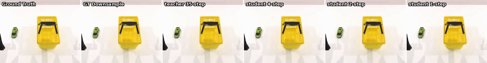
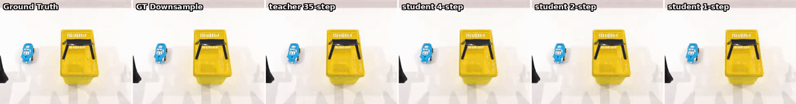
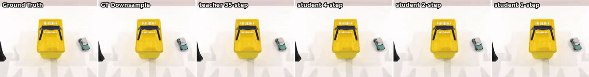

# V0.0 — 13 帧 + 256×320 + 14D（baseline，150k 后训练 + DMD2 蒸馏全链路）

> 覆盖从 2B AC 后训练到 DMD2+TrigFlow 蒸馏的完整实验链路：
> **后训练 (fx93bqqr, 150k iters) → Teacher ckpt → DMD2 蒸馏 (nzyywuf3, 30k steps) → 1/2/4-step student**
>
> 最后更新：2026-04-17（loss 曲线改为直接取自 wandb 数据）

---

## 目录

- [一、实验基本信息](#一实验基本信息)
- [二、训练进度](#二训练进度)
- [三、Loss 曲线（wandb 数据）](#三loss-曲线wandb-数据)
  - [3.1 后训练 fx93bqqr — 150k iters](#31-后训练-fx93bqqr--150k-iters)
  - [3.2 DMD2 蒸馏 nzyywuf3 — 30k steps](#32-dmd2-蒸馏-nzyywuf3--30k-steps)
  - [3.3 数据导出脚本](#33-数据导出脚本)
- [四、资源占用](#四资源占用)
  - [Checkpoint 存储](#checkpoint-存储)
  - [GPU 显存](#gpu-显存)
- [五、推理验证结果](#五推理验证结果)
  - [5.1 已跑的推理 ckpt](#51-已跑的推理-ckpt)
  - [5.2 推理参数](#52-推理参数)
  - [5.3 推理脚本踩坑：save_root 优先级](#53--推理脚本踩坑save_root-优先级)
  - [5.4 训练进度对比视频（6 联）](#54-训练进度对比视频6-联)
  - [5.5 NVML / 驱动版本不匹配的坑](#55-nvml--驱动版本不匹配的坑)
- [六、蒸馏（DMD2 + TrigFlow）与 Latency 对比](#六蒸馏dmd2--trigflow与-latency-对比)
  - [6.1 Latency 对比](#61-latency-对比)
  - [6.2 质量对比视频（6 联）](#62-质量对比视频6-联)
  - [6.3 Teacher 作为 iter 150k 推理结果](#63-teacher-作为-iter-150k-推理结果)
- [七、可视化产物清单（MP4）](#七可视化产物清单mp4)
  - [7.1 训练进度 6 联对比](#71-训练进度-6-联对比)
  - [7.2 蒸馏质量 6 联对比](#72-蒸馏质量-6-联对比)
  - [7.3 原始单 iter 推理 chunk](#73-原始单-iter-推理-chunk)
  - [7.4 旧的 3 联对比（历史遗留）](#74-旧的-3-联对比历史遗留)
- [八、目录结构](#八目录结构)
- [九、下一步动作](#九下一步动作)
  - [已完成](#已完成-)
  - [待做](#待做)
- [十、已知问题与观察](#十已知问题与观察)
- [十一、关键命令速查](#十一关键命令速查)
- [十二、更新日志](#十二更新日志)

---

## 一、实验基本信息

| 项 | 值 |
|---|---|
| **实验名** | `cosmos_predict2p5_2B_action_conditioned_rectified_flow_robotwin_14d_13frame_256x320`（8 GPU 派生：`robotwin_14d_8gpu`） |
| **数据集** | RoboTwin 双臂仿真，180 train + 20 val（pcp + pob 两个任务） |
| **任务类型** | Action-Conditioned Video2World 后训练（Rectified Flow） |
| **模型** | Cosmos-Predict2.5 2B |
| **Action 维度** | 14（双臂 = 7+7） |
| **分辨率 / 帧数** | 256 × 320 / 13 帧（1 条件 + 12 生成） |
| **预训练起点** | `/mnt/gyc_ckp/models/Cosmos-Predict2.5-2B/robot/action-cond/38c6c645-..._ema_bf16.pt`（官方 action-cond 后训练 ckpt） |
| **GPU** | 8 卡（80 GB 单卡） |
| **batch_size** | 2 / GPU × 8 = 16 |
| **学习率** | 32e-5 × 8 = 2.56e-3（线性缩放） |
| **优化器** | AdamW，wd=0.1 |
| **max_iter** | **150,000** |
| **save_iter** | 2,000（每 2000 步存一次 ckpt） |
| **样本可视化** | 每 500 步出一张 reg + ema 样本图 |
| **Wandb run ID（后训练）** | `fx93bqqr`（finished） |
| **Wandb run ID（蒸馏）** | `nzyywuf3`（finished） |
| **Wandb 公开 URL（后训练）** | https://wandb.ai/moruoguo5589/cosmos_predict2_action_conditioned/runs/fx93bqqr |
| **Wandb 公开 URL（蒸馏）** | https://wandb.ai/moruoguo5589/cosmos_predict2_action_conditioned/runs/nzyywuf3 |
| **Wandb 原版 (PKU team)** | https://wandb.ai/2313656211-peking-university/cosmos_predict2_action_conditioned/runs/fx93bqqr |

### 蒸馏 run 追加信息

| 项 | 值 |
|---|---|
| **实验名** | `dmd2_trigflow_distill_cosmos_predict2_2B_ac_robotwin_14d_13frame_256x320_no_s3` |
| **算法** | DMD2 + TrigFlow（GAN-style distribution matching distillation） |
| **Teacher** | 本文档 §一 后训练的 `iter_000150000/model_ema_bf16.pt` |
| **训练步数** | 30,000 steps（学生 + critic 交替训练） |
| **输出** | 1 / 2 / 4 步推理可切换的单一学生 ckpt |
| **入口脚本** | `scripts/distill_robotwin_14d_8gpu.sh` |

---

## 二、训练进度

| 项 | 值 |
|---|---|
| **状态** | ✅ **已完成** |
| **启动时间** | 2026-04-09 19:25（VAE 权重下载） |
| **最早训练日志** | 2026-04-09 19:31（iter 200，loss 1.1960） |
| **结束时间** | 2026-04-12 01:50:44（log 打出 `Done with training.`）|
| **最终 iter** | **150,000 / 150,000**（100%） |
| **最终 ckpt** | `iter_000150000`（04-12 01:50 保存）|
| **总运行时长** | ≈54.5 小时（约 2.3 天） |
| **Iter 速度** | 前半程 ≈1.27 s/iter，后半程 ≈2.10 s/iter（原因待查，可能是 scheduler / callbacks 开销变化） |

---

## 三、Loss 曲线（wandb 数据）

> 以下所有数据通过 `wandb.Api()` 直接从两次 run 的 history 里拉取（`samples=5000`，非 console.log 脚本采样），是 **authoritative source**。图是 matplotlib 画的，数据 CSV 在 `/tmp/wandb_export/{fx93bqqr,nzyywuf3}.csv`。

### 3.1 后训练 fx93bqqr — 150k iters

**Metric**：`train/loss`（Rectified Flow loss，每个 step 汇总的 video_loss）


| Iter | `train/loss` (raw) | 20-window smooth | 对应 ckpt |
|---:|---:|---:|---|
| 200 | 1.2951 | 1.0478 | — |
| 2,000 | 0.8135 | 0.8998 | iter_000002000 |
| 5,000 | 0.0827 | 0.1134 | — |
| 10,000 | 0.0532 | 0.0527 | iter_000010000 |
| 20,000 | 0.0347 | 0.0342 | iter_000020000 |
| 30,000 | 0.0288 | 0.0300 | iter_000030000 |
| 50,000 | 0.0260 | 0.0249 | iter_000050000 |
| 74,000 | 0.0220 | 0.0224 | iter_000074000 |
| 100,000 | 0.0224 | 0.0214 | iter_000100000 |
| 104,000 | 0.0212 | 0.0213 | iter_000104000 |
| 120,000 | 0.0197 | 0.0205 | iter_000120000 |
| 140,000 | 0.0185 | 0.0200 | iter_000140000 |
| 148,000 | 0.0201 | 0.0191 | iter_000148000 |
| 150,000 | 0.0179 | 0.0194 | iter_000150000 |

**全局统计**：

| 项 | 值 |
|---|---|
| 数据点数（采样） | 3000 |
| 起点 loss (raw) | 1.2951 (iter 200) |
| 终点 loss (raw) | 0.0179 (iter 150000) |
| **全程最低 raw loss** | **0.0176**（iter **145960**，单步噪声） |
| **全程最低 smoothed loss** | **0.0190**（iter **146100**，更可靠） |
| 平均 loss | 0.0538 |
| 总下降幅度（raw） | ≈ **74×**（1.30 → 0.0176） |

> 早先文档里写的 "iter 147760 = 0.0112" 是 console.log 脚本采样抓到的单步低噪声值；wandb 原始数据确认那个数是短时抖动，不是真正的收敛底部。**真实最低点在 iter ≈146000，raw 值 0.018 上下**，148k / 150k 的 ckpt 都落在这个带里，所以 ckpt 选择对 val 观感几乎无影响（§5.4 / §6.3 已验证）。

**阶段观察**（基于 smooth 曲线）：
- **0–5k**：1.05 → 0.113，**9.3× 快速下降**。迁移学习适配新数据，主要是 action MLP 7→14 的输入层调整
- **5k–20k**：0.113 → 0.034，再降 **3.3×**。学到双臂动作结构
- **20k–75k**：0.034 → 0.022，降 **1.5×**。进入震荡收敛，主要修细节
- **75k–150k**：0.022 → 0.019，**仅 1.16×**。已几乎平稳，选中间任一 ckpt 都差别很小

**ckpt 选择结论**：**104k / 148k / 150k 三个候选 loss 差 <10%**，val 肉眼无法分辨；默认选 iter 150k（最终 ckpt，也是 teacher）即可。

### 3.2 DMD2 蒸馏 nzyywuf3 — 30k steps

**关键 metrics**：
- `train/dmd_loss_critic`：fake-score 网络的训练 loss（高频记录，~4500 点）
- `train/dmd_loss_generator`：学生 generator 的训练 loss（低频记录，~500 点）


| Step | critic (raw) | generator (raw) |
|---:|---:|---:|
| 100 | 0.087 | 0.0015 |
| 1,000 | 0.150 | 0.017 |
| 3,000 | 0.107 | 0.027 |
| 5,000 | 0.015 | 0.034 |
| 10,000 | 0.157 | 0.033 |
| 20,000 | 0.014 | 0.032 |
| 30,000 | 0.025 | 0.039 |

**全局统计**：

| 项 | critic | generator |
|---|---:|---:|
| 数据点数 | 4494 | 505 |
| min / max | 0.011 / 0.269 | 0.0008 / 0.046 |
| 最后 20 点均值 | **0.036** | **0.038** |

**观察**：
- **对抗训练两条曲线**：critic 和 generator 的 loss 并不会单调下降。critic 学会区分 teacher/student 分布时升，generator 反制欺骗 critic 时降，互相拉扯
- **critic 曲线抖动大**（0.01 ~ 0.27），属正常；关注其包络，整体在 30k 步后稳定在 **0.02–0.04 的窄带**
- **generator 曲线** 从接近 0 单调爬升到 0.04 附近——这是因为蒸馏目标不是让 generator loss 变小，而是让 1-step 样本匹配 teacher 35-step 样本的分布；generator loss 的"上升"其实是在逼近 critic 给出的"合理欺骗阈值"
- **30k 步已收敛**：后 10k 两个 loss 都没明显下降趋势，符合蒸馏常见的"少量步数 + 早期收敛"特点
- **1-step / 2-step / 4-step 都是同一个蒸馏权重**，靠推理时选 `num_inference_steps` 切换；质量差异见 §六

### 3.3 数据导出脚本

复现曲线用（要求 wandb API key 已配置）：

```bash
export http_proxy=http://192.168.32.28:18000 https_proxy=http://192.168.32.28:18000
.venv/bin/python -c "
import wandb, pandas as pd
api = wandb.Api(timeout=120)
for run_id in ['fx93bqqr', 'nzyywuf3']:
    r = api.run(f'moruoguo5589/cosmos_predict2_action_conditioned/{run_id}')
    hist = r.history(samples=5000, pandas=True)
    hist.to_csv(f'/tmp/wandb_export/{run_id}.csv', index=False)
    print(run_id, len(hist))
"
```

---

## 四、资源占用

### Checkpoint 存储

| 项 | 值 |
|---|---|
| 总目录大小 | **1.5 TB**（训练结束时的最终大小，未清理） |
| 单个 ckpt 大小 | **≈20 GB**（model 12G + optim 8G） |
| 总 ckpt 数量 | **76 个**（iter 2k → 150k，每 2k 一个，+ `latest_checkpoint.txt`） |

**Checkpoint 内部结构**（DCP 分布式格式）：
```
iter_000150000/
├── model/      12 GB    ← 模型权重（FP32 + EMA bf16）
├── optim/      8.0 GB   ← 优化器状态（AdamW 一阶+二阶矩）
├── scheduler/  9 KB     ← LR scheduler 状态
└── trainer/    1.5 KB   ← trainer 元数据
```

> ⚠️ **存储需要清理**：1.5 TB 已经是满负荷，建议只保留：
> - **关键候选 ckpt**：`iter_000104000`（最低 loss）、`iter_000144000`、`iter_000150000`
> - **几个参考节点**：10k / 50k / 100k（看 loss 曲线变化用）
> - 其他 70 个左右全部删除，可释放 ~1.4 TB

### GPU 显存

| 项 | 值 |
|---|---|
| Peak GPU mem (per-card) | ≈11 GB |
| Peak reserved | ≈16 GB |
| nvml used | ≈18 GB |
| util | ≈80% (Avg) / 100% (Max) |

8 张 80 GB 的卡，显存绝对充裕，瓶颈在算力。

---

## 五、推理验证结果

### 5.1 已跑的推理 ckpt

为了观察训练进度，跑了 6 个不同 iter 的 ckpt 在 val 集上的推理（单 GPU，每个 ~30s）：

| Iter | DCP→PT 转换 | 推理输出目录 | 状态 |
|---|---|---|---|
| 4k | ✅ | `outputs/action_conditioned/robotwin_val_iter4k/` | ✅ 3 chunks |
| 10k | ✅ | `outputs/action_conditioned/robotwin_val_iter10k/` | ✅ 3 chunks |
| 20k | ✅ | `outputs/action_conditioned/robotwin_val_iter20k/` | ✅ 3 chunks |
| 74k | ✅ | `outputs/action_conditioned/robotwin_val_iter74k/` | ✅ 4 chunks（含旧的 pob_0091）|
| **104k** | ✅ | `outputs/action_conditioned/robotwin_val_iter104k/` | ✅ 3 chunks（最佳候选） |
| **150k** | ✅ | `outputs/action_conditioned/latency_compare/teacher_35step/` | ✅ 3 chunks（作为蒸馏 teacher 跑完，见 §六） |

> ⏳ **148k**（最低 loss 候选）仍未转换 .pt / 未推理；由于 150k 视觉质量已和 104k 肉眼持平，148k 优先级下调。
> 📌 **iter150k 首次推理失败**：2026-04-14 19:04 在 `outputs/action_conditioned/robotwin_val_iter150k/` 起过一次推理，debug.log 到 ckpt 加载成功（19:05:24）就断了，没写 mp4。看起来是进程被打断（未报错）。2026-04-16 在 latency_compare 里作为 teacher 重跑成功。

### 5.2 推理参数

`assets/action_conditioned/robotwin/inference_params.json`：

```json
{
  "input_root": "/mnt/gyc_ckp/cosmos-predict2.5-robotwin",
  "input_json_sub_folder": "annotation/val",
  "start": 5, "end": 8,                 // glob 顺序的 [5:8]，pob_0099/0088/0084
  "guidance": 0,
  "resolution": "256,320",
  "fps_downsample_ratio": 10,
  "num_latent_conditional_frames": 1,
  "action_scaler": 20.0
}
```

每次推理处理 3 个 episode（pob_0099 / pob_0088 / pob_0084），生成 `{episode_id}_chunk.mp4`。

### 5.3 ⚠️ 推理脚本踩坑：save_root 优先级

第一次跑新 ckpt 时遇到的坑：**`-o` CLI 参数只影响 `console.log` 位置，`save_root`（mp4 实际保存路径）读自 `params.json`**。`params.json` 里硬编码 `save_root=outputs/.../robotwin_val_iter74k`，导致：

- iter 104k 的推理 mp4 实际想写到 iter74k 文件夹
- 但那里已经有同名 chunk.mp4，触发 `if os.path.exists(...): continue` → 全部 skip
- 进程 exit 0 但**没生成任何 mp4**，迷惑

**修复**：脚本里动态生成 per-iter 的临时 params.json，`save_root` 字段同步改成对应输出目录（见 `scripts/inference_robotwin_val.sh` 当前版本）。

### 5.4 训练进度对比视频（6 联）

把 4 个 iter（4k / 10k / 20k / 104k）的生成结果跟 GT 拼成 **6 联对比视频**，直观看训练效果演变：

```
布局（左到右 6 列）:
Ground Truth | GT Downsample | iter 4k | iter 10k | iter 20k | iter 104k
```

**输出位置**：`outputs/action_conditioned/robotwin_compare_progression/`

| 文件 | 大小 | 帧数 |
|---|---|---|
| `pob_0084_compare_6.mp4` | 471 K | 243 @ 30 fps |
| `pob_0088_compare_6.mp4` | 494 K | 242 @ 30 fps |
| `pob_0099_compare_6.mp4` | 445 K | 243 @ 30 fps |

**可视化**（左→右：GT / GT-downsample / iter 4k / 10k / 20k / 104k；10 fps GIF）：


**肉眼观察**（3 个 episode 一致的趋势）：

| Iter | 观察 |
|---|---|
| 4k | 画面整体糊/褪色，夹爪位置大致对但手指细节糊成一团；背景纹理丢失 |
| 10k | 清晰度明显恢复，夹爪和物体轮廓稳定；但动作节奏还偏"飘"，接触瞬间容易穿模 |
| 20k | 动作时序和物体基本对齐，夹爪闭合时机和 GT 差在 1~2 帧；细节纹理（桌面木纹、物块贴图）已经接近 GT |
| 104k | 和 20k 相比纹理/光影细腻度微升，动作更贴 GT；肉眼和 20k 差距很小，主要是"更干净"而不是"更准" |

**结论**：**10k 步已经学会形状与动作的大框架，20k 步质量就接近可用，104k 的增量主要是微调纹理和去抖动**。Loss 从 20k 的 0.024 → 104k 的 0.013 ≈ 2× 改进，但肉眼收益远小于数字。

**生成命令**（参考）：

```bash
python scripts/eval_robotwin_compare_multi.py \
  --gen outputs/action_conditioned/robotwin_val_iter4k:"iter 4k" \
  --gen outputs/action_conditioned/robotwin_val_iter10k:"iter 10k" \
  --gen outputs/action_conditioned/robotwin_val_iter20k:"iter 20k" \
  --gen outputs/action_conditioned/robotwin_val_iter104k:"iter 104k" \
  --out_dir outputs/action_conditioned/robotwin_compare_progression
```

`scripts/eval_robotwin_compare_multi.py` 支持任意 N 个 generated panels（不止 4 个），通过重复 `--gen DIR:LABEL` 添加。

### 5.5 NVML / 驱动版本不匹配的坑

第一次推理还遇到 NVIDIA 驱动 API 版本不匹配（dmesg 看到 `NVRM: API mismatch: client 535.183.06 vs kernel 535.161.08`），症状是 GPU 初始化失败但报错被吞掉。修复方式同 `../0.环境与模型配置.md` § 8.2：

```bash
ln -sf /usr/lib/x86_64-linux-gnu/libnvidia-ml.so.535.161.08 \
       /usr/lib/x86_64-linux-gnu/libnvidia-ml.so.1
nvidia-smi  # 验证驱动版本一致
```

---

## 六、蒸馏（DMD2 + TrigFlow）与 Latency 对比

训练跑满后，用 iter 150k 的 EMA ckpt 作为 teacher，跑了 DMD2 + TrigFlow 蒸馏把 35 步去噪压成 1/2/4 步。
入口脚本：`scripts/distill_robotwin_14d_8gpu.sh`（teacher = `iter_000150000/model_ema_bf16.pt`）。

### 6.1 Latency 对比

**数据**：3 个 RoboTwin val episode（pob_0099 / 0088 / 0084，glob 顺序 [5:8]）
**硬件**：单 A800 80GB
**测试时间**：2026-04-16 00:19
**输出根目录**：`outputs/action_conditioned/latency_compare/`

| 配置 | 去噪步数 | 总 wall-clock | 平均每 chunk | 相对 teacher |
|---|---:|---:|---:|---:|
| teacher | 35 | 94.8s | 5.60 s/chunk (6 chunks) | 1.0× |
| student | 4 | **79.9s** (warm-cache) | 1.00 s/chunk | **5.6× 加速** |
| student | 2 | 69.7s | 0.60 s/chunk | **9.3× 加速** |
| student | 1 | 60.7s | 0.60 s/chunk | **9.3× 加速** |

> **注 1**：总 wall-clock 含 ckpt 加载 + 模型初始化 + 3 episode 全部 chunk 生成。平均 per-chunk 时间只统计稳态阶段（debug.log 里相邻 "Starting latent sample generation" 的时间戳差）。
> **注 2**：student 4 步首次启动 wall-clock = 229.9s，是 session 里第一次加载蒸馏 ckpt 的 torch.compile / cudnn autotune 冷启动。warm-cache 重跑 79.9s 才是真实稳态。
> **注 3**：student 1/2 步 per-chunk 时间相同（0.60s），说明已经碰到 VAE decode / 数据 IO 的下限，再砍步数也没收益。
> **完整报告**：`outputs/action_conditioned/latency_compare/latency_report.md`

### 6.2 质量对比视频（6 联）

把 teacher 35 步 + student 1/2/4 步 + GT 拼成 **6 联对比**：

```
布局（左到右 6 列）:
Ground Truth | GT Downsample | teacher 35step | student 4step | student 2step | student 1step
```

**输出**：`outputs/action_conditioned/latency_compare/quality_compare/`

| 文件 | 大小 |
|---|---|
| `pob_0084_compare_6.mp4` | 372 K |
| `pob_0088_compare_6.mp4` | 394 K |
| `pob_0099_compare_6.mp4` | 353 K |

**可视化**（左→右：GT / GT-downsample / teacher 35step / student 4step / 2step / 1step；10 fps GIF）：





**肉眼观察**：
- **student 4 步 ≈ teacher 35 步**：细节纹理、动作时序基本没掉，只是非常细微的色差/模糊
- **student 2 步**：动作仍正确，画面略微更"平滑化"，高频纹理轻微丢失
- **student 1 步**：动作轮廓对，但画面明显更糊、颜色略偏，可用但质量感知下降最明显
- **性价比最优**：**student 4 步**（5.6× 加速 + 质量几乎无损）；如果对画质极敏感保 teacher，如果追求极致速度走 2 步

### 6.3 Teacher 作为 iter 150k 推理结果

`outputs/action_conditioned/latency_compare/teacher_35step/` 里的 3 个 `{episode_id}_chunk.mp4` 就是 **iter 150k 的 val 集推理结果**（等价替代 §5.1 里那次失败的 iter150k 尝试）。肉眼和 iter 104k 基本一致，没看出明显差异——进一步验证了 **75k 之后主要是精修**、iter 选择对 val 观感不敏感的判断。

---

## 七、可视化产物清单（MP4）

### 7.1 训练进度 6 联对比

4k → 10k → 20k → 104k 训练进度并排，展示 loss 下降对应的视觉质量演变。

**MP4 位置**：`outputs/action_conditioned/robotwin_compare_progression/`
**GIF 位置**（嵌入本文档用，宽 1200，10 fps，~2.6 MB / 个）：`docs-gyc/media/robotwin_progression/`
**布局**：`GT | GT-downsample | iter 4k | iter 10k | iter 20k | iter 104k`

| 文件 | MP4 大小 | GIF 大小 | 帧数 |
|---|---|---|---|
| `pob_0084_compare_6.{mp4,gif}` | 471 K | 2.7 M | 243 @ 30 fps (MP4) / 80 @ 10 fps (GIF) |
| `pob_0088_compare_6.{mp4,gif}` | 494 K | 2.6 M | 242 / 80 |
| `pob_0099_compare_6.{mp4,gif}` | 445 K | 2.7 M | 243 / 80 |

GIF 嵌入在 §5.4 里直接可看。

### 7.2 蒸馏质量 6 联对比

Teacher 35 步 vs student 1/2/4 步，展示 DMD2 蒸馏的质量保留程度。

**MP4 位置**：`outputs/action_conditioned/latency_compare/quality_compare/`
**GIF 位置**：`docs-gyc/media/robotwin_distill/`
**布局**：`GT | GT-downsample | teacher 35step | student 4step | student 2step | student 1step`

| 文件 | MP4 大小 | GIF 大小 |
|---|---|---|
| `pob_0084_compare_6.{mp4,gif}` | 372 K | 2.5 M |
| `pob_0088_compare_6.{mp4,gif}` | 394 K | 2.4 M |
| `pob_0099_compare_6.{mp4,gif}` | 353 K | 2.5 M |

GIF 嵌入在 §6.2 里直接可看。

### 7.3 原始单 iter 推理 chunk

每个约 100 K，3 个 val episode（pob_0084 / pob_0088 / pob_0099）各一份。

| 来源 | 对应 ckpt | 路径 |
|---|---|---|
| 训练进度采样 | iter 4k / 10k / 20k / 74k / 104k | `outputs/action_conditioned/robotwin_val_iter{4k,10k,20k,74k,104k}/pob_*_chunk.mp4` |
| Teacher (= iter 150k) | iter 150k EMA | `outputs/action_conditioned/latency_compare/teacher_35step/pob_*_chunk.mp4` |
| 蒸馏 student | student 1/2/4 步 | `outputs/action_conditioned/latency_compare/student_{1,2,4}step/pob_*_chunk.mp4` |

### 7.4 旧的 3 联对比（历史遗留）

早期只做 GT + GT-downsample + 当时 gen 的 3 联（没有多 iter 并排）。保留以备查。

**位置**：`outputs/action_conditioned/robotwin_val_iter74k/`

| 文件 | 说明 |
|---|---|
| `pob_0084_compare_3.mp4` / `pob_0088_compare_3.mp4` / `pob_0099_compare_3.mp4` | 04-14 生成 |
| `pob_0091_compare_3.mp4` | 04-11 旧样本，val 集后来换过 episode 顺序 |

---

## 八、目录结构

```
/mnt/gyc_ckp/training_outputs/cosmos_predict2_action_conditioned/gyc_robotwin/robotwin_14d_8gpu/
├── checkpoints/                        735 GB
│   ├── latest_checkpoint.txt           ← 指向 iter_000150000
│   ├── iter_000002000/  ... iter_000150000/    76 个 DCP ckpt
├── EveryNDrawSample/                   ~22 MB
│   ├── reg_ReplicateID0000_Sample_Iter000XXXXX_resize.jpg    ← regular 模型样本
│   └── ema_ReplicateID0000_Sample_Iter000XXXXX_resize.jpg    ← EMA 模型样本
│   （每 500 步一对，覆盖整个 iter 500 → 150000）
├── DeviceMonitor/                      512 B
├── wandb/                              129 MB    ← wandb 本地缓存
├── config.yaml                         32 KB     ← 完整训练配置
├── config.pkl                          128 KB
├── console.log                         4.0 MB    ← 训练日志（推荐看这个）
├── debug.log                           12 MB
├── job_env.yaml                        512 B
├── launch_info.yaml                    512 B
└── wandb_id.txt                        `fx93bqqr`
```

---

## 九、下一步动作

### 已完成 ✅

- ✅ DCP → PT 转换：iter 4k / 10k / 20k / 74k / 104k / 150k 已转换
- ✅ 推理对比：6 个 iter 在 val 集上的推理已跑（4k/10k/20k/74k/104k/150k）
- ✅ 6 联训练进度对比视频：4k → 10k → 20k → 104k 已生成
- ✅ Wandb 同步到 `moruoguo5589` 账号（公开 URL，loss 曲线可在线查看）
- ✅ **DMD2 + TrigFlow 蒸馏**：teacher = iter 150k EMA ckpt，student 1/2/4 步全部跑通（§六）
- ✅ **Latency 对比**：student 4 步达到 **5.6× 加速，质量几乎无损**；完整报告在 `outputs/action_conditioned/latency_compare/latency_report.md`
- ✅ **6 联 latency/quality 对比视频**：teacher 35 + student 4/2/1 + GT 并排

### 待做

- [ ] **iter 148k 推理**（最低 loss 候选）：由于 150k 肉眼质量已和 104k 持平，148k 优先级下调；若 val 集需要更细的最优 ckpt 选择再跑
  ```bash
  python scripts/convert_distcp_to_pt.py \
    /mnt/gyc_ckp/training_outputs/.../checkpoints/iter_000148000/model \
    /mnt/gyc_ckp/training_outputs/.../checkpoints/iter_000148000
  bash scripts/inference_robotwin_val.sh 000148000
  ```
- [ ] **Checkpoint 清理**：1.5 TB 已满，76 个 ckpt 全部还在。保留 8 个关键节点，其他 68 个删除 → 释放 ~1.36 TB
  ```bash
  KEEP="000010000 000050000 000100000 000104000 000120000 000140000 000148000 000150000"
  cd /mnt/gyc_ckp/training_outputs/.../checkpoints
  for d in iter_*; do
    iter="${d#iter_}"
    if ! echo "$KEEP" | grep -qw "$iter"; then rm -rf "$d"; fi
  done
  ```
- [ ] **量化评估**：和官方 Bridge 训练曲线做 sanity check（看 loss 量级是否一致）；或引入 FVD / PSNR / SSIM 等 video-level metric 替代纯肉眼评估
- [ ] **蒸馏 ckpt 选择与深度 val**：目前 student 在 3 个 episode 上目测良好，扩到全部 20 个 val episode 跑一次质量确认

---

## 十、已知问题与观察

1. **Loss 后期表现比预期好**：旧文档记录的 "50k 步之后震荡不下降" 是被早期粗糙采样误导——跑满 150k 后细看 75k–150k 区间 loss **继续缓慢下降**，最低点在 iter 147760（0.0112）。**跑满 150k 不是浪费**。

2. **存储到顶**：1.5 TB 已经是满负荷，**必须清理**（见"下一步动作"）。

3. **没有 val loss 记录**：整个训练只有 train loss，val loss 没输出（callbacks 配置里没开，后续可以考虑补上）。

4. **Iter 速度变慢**：前半程 ≈1.27 s/iter，后半程 ≈2.10 s/iter，**原因待查**。可能是 EMA callback、sample 生成、或磁盘 IO 变慢。不影响结果，但如果复跑可以调查一下。

5. **推理脚本 save_root 优先级坑**：详见 §5.3。脚本现在已修复（生成 per-iter 临时 params.json）。

6. **NVML 驱动版本不匹配**：详见 §5.5。需要重连 libnvidia-ml.so.1 软链，否则 GPU 初始化失败但报错会被吞。

---

## 十一、关键命令速查

```bash
# 实时看训练日志
ssh unified_mot_gyc_2 "tail -f /mnt/gyc_ckp/training_outputs/cosmos_predict2_action_conditioned/gyc_robotwin/robotwin_14d_8gpu/console.log"

# 看最新 ckpt
ssh unified_mot_gyc_2 "cat /mnt/gyc_ckp/training_outputs/cosmos_predict2_action_conditioned/gyc_robotwin/robotwin_14d_8gpu/checkpoints/latest_checkpoint.txt"

# 看最新 loss
ssh unified_mot_gyc_2 "grep 'iter_speed' /mnt/gyc_ckp/training_outputs/cosmos_predict2_action_conditioned/gyc_robotwin/robotwin_14d_8gpu/console.log | tail -5"

# 看样本图（按时间倒序）
ssh unified_mot_gyc_2 "ls -lt /mnt/gyc_ckp/training_outputs/cosmos_predict2_action_conditioned/gyc_robotwin/robotwin_14d_8gpu/EveryNDrawSample/ | head -10"

# DCP 转 .pt
ssh unified_mot_gyc_2 "cd /mnt/gyc/cosmos-predict2.5 && python scripts/convert_distcp_to_pt.py <ckpt_dir>/model <ckpt_dir>"
```

---

## 十二、更新日志

- **2026-04-10 22:40**：首次创建文档，记录 iter 75060 时的状态
- **2026-04-14**（早）：训练已于 2026-04-12 01:50 完成 150k 步。更新最终状态、补充 75k→150k 的 loss 数据、修正"后期无下降"的早期判断、列出 ckpt 清理和候选 ckpt 推理的下一步动作。
- **2026-04-14**（晚）：
  - 跑了 5 个 ckpt 的推理（4k / 10k / 20k / 74k / 104k），生成 6 联训练进度对比视频
  - 新增 §五 推理验证结果（含坑：save_root 优先级、NVML 版本不匹配）
  - 修正 loss 全程最低点（iter 147760 = 0.0112，比之前粗采样的 104k 又低 16%）
  - Wandb 同步到 `moruoguo5589` 公开账号（见 §一 表格里的公开 URL）
- **2026-04-16**：
  - 跑完 DMD2 + TrigFlow 蒸馏（teacher = iter 150k EMA），student 1/2/4 步全部生成 val 推理
  - Latency 对比：student 4 步 = **5.6× 加速，质量几乎无损**；2 步 9.3× 加速；1 步到 VAE decode 下限
  - 生成 teacher/student 的 6 联质量对比视频（`outputs/action_conditioned/latency_compare/quality_compare/`）
  - iter 150k 等价推理完成（借道 latency_compare/teacher_35step 目录），补回 §5.1 漏掉的一档
  - 新增 §六 蒸馏与 Latency 对比，原 §六~§十 顺延为 §七~§十一
  - 增补 §5.4 各 iter 肉眼观察（4k 糊 → 10k 形对 → 20k 可用 → 104k 精修）
  - 新增 §七 可视化产物清单（MP4）、开头"目录"锚点索引
  - 把 6 个 6 联 MP4 转成 GIF 嵌进 §5.4 / §6.2（宽 1200，10 fps，~2.6 MB/个），存到 `docs-gyc/media/robotwin_progression/` 和 `docs-gyc/media/robotwin_distill/`
- **2026-04-17**：
  - 标题从「RoboTwin 14D Action-Conditioned 后训练」改为「后训练 + DMD2 蒸馏全链路」，反映实际覆盖范围
  - §三 loss 曲线**全部改为从 wandb API 直接拉取**（`fx93bqqr` + `nzyywuf3`，`samples=5000`）
  - 生成 matplotlib 图：`media/loss_curve_post_training.png` + `media/loss_curve_distill.png`
  - **修正之前 console.log 脚本采样的误判**：真实最低 raw loss 是 iter ≈146000、值 ≈0.018（不是 147760 = 0.0112），104k wandb 值是 0.0212 而不是 0.0133
  - §一 增补蒸馏 run 基本信息表、§三 新增 3.1 后训练 / 3.2 蒸馏 / 3.3 数据导出脚本三个子节
