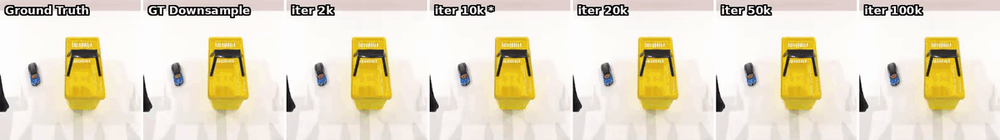
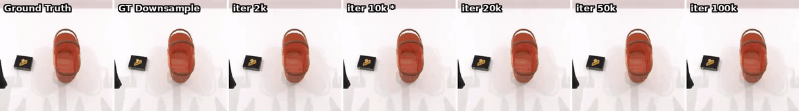

# V0.1 —— 16 帧，无 value

RoboTwin 双臂 14D，AC 后训练，生成 16 帧，224×224。基础版本，不带 value。翔哥提的 "Cosmos Stage1 定制化后训练" 的第一版实现。

## 基本参数

| 参数 | 值 | 备注 |
|---|---|---|
| Wandb | [`moruoguo5589/cosmos_predict2_action_conditioned/29iha98h`](https://wandb.ai/moruoguo5589/cosmos_predict2_action_conditioned/runs/29iha98h) | run 名 `robotwin_14d_v01_16f_224_8gpu` |
| FPS | 30（内容）/ 4（条件 tag） | ⚠️ **配置错配**，见 [失效原因分析](#失效原因分析) |
| 条件帧 | 1 | 单视角，`camera_head` |
| 生成帧数 | 16 | |
| 输入输出总帧数 | 17 | 1 cond + 16 gen |
| 分辨率 | 224 × 224 | |
| 需要有 value | False | `state_t=5`（1 cond + 4 video latent） |
| 动作空间 | 末端位姿 (xyz + rpy) + gripper，14D | 左 6D + 右 6D + 左爪 1D + 右爪 1D；见 `scripts/convert_robotwin_to_cosmos.py:47-64` |
| 任务数据 | place_container_plate (100/100) plate_object_basket (80/100) | v1 切分（pcp 全在 train，val 仅 pob，此 bug 在 v2 修复）；180 trajectories，35,722 帧，~32,660 clips \| stride=1, seq_len=17 |
| 训练量（epochs） | ~49 | 100k × 16 / 32,660 |
| 训练量（steps） | 100,000 | |
| Batchsize \| GPU_num | 2 \| 8GPU | global batch = 16 |
| 训练时间 | 35.25 h | 2026-04-16 03:18 → 2026-04-17 14:33，实测 1.24 s/iter |

## 启动脚本

`scripts/train_robotwin_v01_16frame_8gpu.sh`

## 训练结果

- 最终 loss **~0.016**（iter 100,000）
- 训练全程平稳，无 spike / NaN

## 评估

### 评估流程

用 `scripts/eval_ckpts.py` 扫 ckpt：

1. 每个 ckpt 走一次 `scripts/convert_distcp_to_pt.py` 把 DCP 转成 `model_ema_bf16.pt`
2. 调 `examples/action_conditioned.py` 在 2 个 val 样本（pob_0083 / pob_0091）上跑推理，`num_latent_conditional_frames=1`、`fps_downsample_ratio=10`、`seed=0`
3. 生成 `{episode}_chunk.mp4`（25 帧 @ 20 fps）
4. 对同一样本跨 ckpt 横向 stack 成 `{episode}_compare_7.mp4`（左→右：iter 递增 + GT 在最右）

**扫 ckpt**：2k / 4k / 10k / 20k / 36k / 50k / 76k / 100k，一共 8 个  
**对比样本**：`pob_0083`、`pob_0091`（val/plate_object_basket）  
**对比物**：同 episode、同 seed、同 action 序列下，各 ckpt 生成视频 vs GT 真实视频

产出目录：`outputs/eval_ckpts/v01_sweep/`（`compare/` 存横向拼接的 mp4）

### 视频质量观察

> gif 里从左到右依次是 iter 2k → 100k + 最右一列 GT。对比 gif 来自 `outputs/eval_ckpts/v01_sweep/compare/*.mp4`，转 10 fps / 1200px 宽。

**结论**：**视频生成质量差，有噪声**。具体表现：

- 全程有**明显噪声与纹理抖动**，机械臂边缘与物体轮廓模糊、不稳定
- **动作跟不上 GT**：生成视频中夹爪运动节奏与 GT 对不齐
- **训练 loss 降低 ≠ 视频变好**：后期 iter（50k+）的视觉效果并未比中期（10k–20k）更接近 GT，在部分样本上反而更糊
- 跨 ckpt 看不到清晰的"单调收敛"趋势，生成质量随训练步数呈波动

## 失效原因分析

**核心问题：FPS 错配 7.5×**

- RoboTwin 原生 mp4 = **30 fps**；`dataset_local.py` 里 `fps_downsample_ratio=1` 不抽帧 → 模型实际看到的视频内容 = 30 fps
- 但 `dataset_local.py:435` 硬编码 `data["fps"] = 4`，把 4 fps 的 tag 传进条件器 → **内容 fps ≠ tag fps，差 7.5×**
- Cosmos 预训练用的是 16 fps 左右真实视频（`min_fps_thres=10, max_fps_thres=60`），4 fps 的 tag 等于告诉模型"这是一个非常慢的视频"，与实际 30 fps 内容严重冲突
- `rope_enable_fps_modulation=False`，所以 fps tag 只进条件向量、不影响 RoPE，但这个冲突仍然会让条件信号被模型学成噪声先验 → 体现为生成视频噪声大、动作对不上

**修复方向**（V0.2 处理）：
- (a) 回退 `fps_downsample_ratio=10`：内容 ≈ 3 fps ≈ tag 4 fps，对齐
- (b) 或改 dataset，让 `data["fps"]` 自适应实际抽帧后的 fps

## 状态

✅ 训练完成  
❎ 视频质量验证未通过（噪声大、动作节奏错）  
➡️ 方向切 V0.2（修改分辨率与 FPS 重训）
